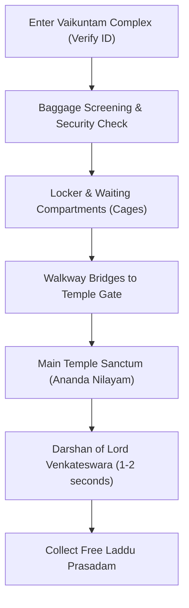

Planning a pilgrimage to the holy temple of **Lord Venkateswara** on the Tirumala hills is a deeply spiritual journey for millions of devotees worldwide. However, managing the logistics, understanding the booking processes, and preparing for the queue waiting times can be overwhelming.

This ultimate guide breaks down everything you need to know to plan a smooth, stress-free Darshan.

---

## 1. Types of Darshan Tickets & Bookings

TTD (Tirumala Tirupati Devasthanams) offers multiple pathways to see the Lord, categorized by price, wait time, and booking location.

### A. Special Entry Darshan (SED) - Rs. 300
This is the most popular option for travelers seeking a structured and relatively fast experience.
* **Cost:** Rs. 300 per person.
* **Booking:** strictly online via the official TTD website (`tirupatibalaji.ap.gov.in`).
* **Release Window:** Quotas are released monthly, exactly **3 months in advance** (e.g., tickets for August are released in late May). Slots are highly competitive and book out within hours.
* **Average Queue Wait Time:** 3 to 6 hours.

### B. Slotted Sarva Darshan (SSD) - Free
For devotees who do not have advance online bookings, TTD provides free offline tokens on a first-come, first-served basis.
* **Cost:** Free.
* **Booking:** Offline counters located in Tirupati city:
  1. **Srinivasam Complex** (opposite the RTC Central Bus Stand)
  2. **Bhudevi Complex** (near Alipiri Link Bus Stand)
  3. **Tirupati Railway Station** (behind Platform 2/3)
* **Release Window:** Issued daily for the same or subsequent day. Counters close once the daily quota is exhausted.
* **Average Queue Wait Time:** 10 to 24 hours depending on the crowd flow.

### C. Divya Darshan (DD) - Free
This ticket is reserved exclusively for walking pilgrims who climb the hills on foot.
* **Cost:** Free.
* **Booking:** Tokens are distributed mid-way on the pedestrian paths (Alipiri or Srivari Mettu).
* **Availability:** Subject to daily limits. If the footpath quota is full, walking pilgrims must join the general SSD queue.

---

## 2. Climbing the Hills: Pedestrian Footpaths

For a traditional experience, many pilgrims choose to walk uphill from Tirupati to Tirumala. There are two primary pathways:

| Feature | Alipiri Mettu (Traditional) | Srivari Mettu (Fastest) |
| :--- | :--- | :--- |
| **Total Steps** | 3,550 Steps | 2,388 Steps |
| **Climbing Time** | 4 - 6 Hours | 2 - 3 Hours |
| **Starting Point** | Alipiri (Tirupati edge) | Srinivasa Mangapuram (15km from Tirupati) |
| **Operating Hours** | Open 24/7 | 6:00 AM to 6:00 PM |
| **Luggage Transfer** | Free counter at start (collect at hilltop) | Free counter at start (collect at hilltop) |

---

## 3. Mandatory Rules & Guidelines

To maintain sanctity and security, TTD enforces strict guidelines. Non-compliance will result in denial of entry.

### A. Strict Traditional Dress Code
* **For Men:** White or light-colored Dhoti (Veshti) with a shirt or half-saree/Uttareeyam. Kurtas with Pyjamas are also permitted. Jeans, shorts, T-shirts, and Western outfits are strictly banned.
* **For Women:** Saree, Half-Saree, or Churidar with a Dupatta (stole). Leggings without a long Kurta or dupatta are not allowed.

### B. Banned Electronics & Luggage
No electronic items are permitted inside the Vaikuntam Queue Complex. This includes:
* Mobile phones
* Cameras and video recorders
* Laptops, tablets, and smartwatches
* Leather items (belts and wallets are allowed but bags are not)

> [!IMPORTANT]
> Deposit all cell phones and heavy luggage at your hotel room or the free luggage/locker counters at Tirupati or Alipiri before entering the line.

---

## 4. Step-by-Step Darshan Process

Once you reach the Vaikuntam Queue Complex (VQC-I or VQC-II):

1. **Vaikuntam Waiting Compartments:** You will be placed in large waiting rooms (referred to as compartments). You may wait here for 1-5 hours. TTD provides free drinking water, milk, and subsidized meals in these rooms.
2. **The Queue Line:** Once the gates open, the crowd moves through covered steel walkways leading to the temple courtyard.
3. **Inner Sanctum (Garbhagriha):** You will pass through the gold-plated entrance (Ananda Nilayam) to view the deity. Due to the high volume of visitors, security personnel move the line quickly. Devotees get approximately 1-3 seconds of direct sight.
4. **Laddu Prasadam:** After leaving the main temple, proceed to the outer counters to collect your delicious free Laddu prasadam using the barcode on your tickets.

---

## 5. Pro-Tips for Families & Seniors

* **Avoid Weekends:** Tuesday to Thursday generally experience shorter waiting queues.
* **Special Privilege Queues:** Senior citizens (65+), infants under 1 year, and physically challenged individuals have dedicated priority slots with minimal walking. Register online under the "Special Privilege Darshan" category.
* **Keep Documents Ready:** You must carry the **original physical photo ID** used during booking (Aadhaar Card, Passport, or Voter ID). Digital copies on phones are not accepted.
